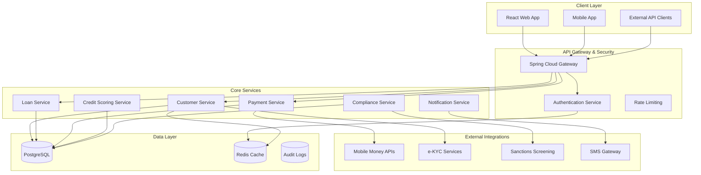

# Design Document: Jilinde Credit Microfinance Management System

## Overview

Jilinde Credit is a cloud-native microfinance management system built on modern Java Spring Boot architecture with PostgreSQL database. The system serves the unbanked population through digital financial inclusion, providing small loans ($50-$50,000) with AI-powered credit scoring, mobile money integration, and comprehensive security compliance.

The architecture follows microservices patterns with clear separation of concerns, enabling scalability, maintainability, and regulatory compliance. The system is designed for 99.9% uptime with disaster recovery capabilities and supports both group lending and individual lending models.

## Architecture

### High-Level Architecture



### Technology Stack

**Backend:**
- Java 17+ with Spring Boot 3.x
- Spring Security 6.x for authentication and authorization
- Spring Data JPA with Hibernate for ORM
- PostgreSQL 15+ for primary database
- Redis for caching and session management
- Spring Cloud Gateway for API gateway
- Apache Kafka for event streaming
- Docker containers with Kubernetes orchestration

**Frontend:**
- React 18+ with TypeScript
- Material-UI for component library
- Progressive Web App (PWA) capabilities
- Responsive design for mobile-first approach

**Security & Compliance:**
- AES-256 encryption at rest
- TLS 1.3 for data in transit
- OAuth 2.0 with JWT tokens
- Multi-factor authentication
- Role-based access control (RBAC)

## Components and Interfaces

### Customer Service

**Responsibilities:**
- Digital customer onboarding and e-KYC verification
- Customer profile management
- Biometric data handling
- Customer relationship management

**Key Interfaces:**
```java
@RestController
@RequestMapping("/api/v1/customers")
public class CustomerController {
    
    @PostMapping("/onboard")
    public ResponseEntity<OnboardingResponse> initiateOnboarding(
        @RequestBody OnboardingRequest request);
    
    @PostMapping("/verify-kyc")
    public ResponseEntity<KycVerificationResponse> verifyKyc(
        @RequestBody KycVerificationRequest request);
    
    @PostMapping("/biometric")
    public ResponseEntity<BiometricResponse> captureBiometric(
        @RequestBody BiometricRequest request);
    
    @GetMapping("/{customerId}/profile")
    public ResponseEntity<CustomerProfile> getCustomerProfile(
        @PathVariable String customerId);
}
```

### Loan Service

**Responsibilities:**
- Loan origination and approval workflows
- Loan product configuration
- Interest and penalty calculations
- Loan lifecycle management

**Key Interfaces:**
```java
@RestController
@RequestMapping("/api/v1/loans")
public class LoanController {
    
    @PostMapping("/applications")
    public ResponseEntity<LoanApplicationResponse> createApplication(
        @RequestBody LoanApplicationRequest request);
    
    @PostMapping("/approve/{applicationId}")
    public ResponseEntity<LoanApprovalResponse> approveLoan(
        @PathVariable String applicationId,
        @RequestBody LoanApprovalRequest request);
    
    @PostMapping("/disburse/{loanId}")
    public ResponseEntity<DisbursementResponse> disburseLoan(
        @PathVariable String loanId,
        @RequestBody DisbursementRequest request);
    
    @GetMapping("/{loanId}/schedule")
    public ResponseEntity<RepaymentSchedule> getRepaymentSchedule(
        @PathVariable String loanId);
}
```

### Payment Service

**Responsibilities:**
- Payment processing and mobile money integration
- Transaction management
- Payment reconciliation
- Receipt generation

**Key Interfaces:**
```java
@RestController
@RequestMapping("/api/v1/payments")
public class PaymentController {
    
    @PostMapping("/mobile-money")
    public ResponseEntity<PaymentResponse> processMobileMoneyPayment(
        @RequestBody MobileMoneyPaymentRequest request);
    
    @PostMapping("/callback/mobile-money")
    public ResponseEntity<Void> handleMobileMoneyCallback(
        @RequestBody MobileMoneyCallbackRequest request);
    
    @GetMapping("/{paymentId}/status")
    public ResponseEntity<PaymentStatus> getPaymentStatus(
        @PathVariable String paymentId);
    
    @GetMapping("/customer/{customerId}/history")
    public ResponseEntity<List<PaymentHistory>> getPaymentHistory(
        @PathVariable String customerId);
}
```

### Credit Scoring Service

**Responsibilities:**
- AI-powered credit assessment
- Alternative data analysis
- Credit score calculation and explanation
- Risk assessment

**Key Interfaces:**
```java
@RestController
@RequestMapping("/api/v1/credit-scoring")
public class CreditScoringController {
    
    @PostMapping("/assess")
    public ResponseEntity<CreditAssessmentResponse> assessCreditworthiness(
        @RequestBody CreditAssessmentRequest request);
    
    @PostMapping("/alternative-data")
    public ResponseEntity<AlternativeDataResponse> analyzeAlternativeData(
        @RequestBody AlternativeDataRequest request);
    
    @GetMapping("/{customerId}/score")
    public ResponseEntity<CreditScore> getCreditScore(
        @PathVariable String customerId);
    
    @GetMapping("/{customerId}/explanation")
    public ResponseEntity<CreditScoreExplanation> getCreditScoreExplanation(
        @PathVariable String customerId);
}
```

### Compliance Service

**Responsibilities:**
- AML/CFT screening and monitoring
- Fraud detection and prevention
- Regulatory reporting
- Audit trail management

**Key Interfaces:**
```java
@RestController
@RequestMapping("/api/v1/compliance")
public class ComplianceController {
    
    @PostMapping("/screen")
    public ResponseEntity<ScreeningResponse> screenCustomer(
        @RequestBody ScreeningRequest request);
    
    @PostMapping("/suspicious-activity")
    public ResponseEntity<SarResponse> reportSuspiciousActivity(
        @RequestBody SarRequest request);
    
    @GetMapping("/reports/regulatory")
    public ResponseEntity<RegulatoryReport> generateRegulatoryReport(
        @RequestParam String reportType,
        @RequestParam LocalDate startDate,
        @RequestParam LocalDate endDate);
    
    @PostMapping("/fraud-detection")
    public ResponseEntity<FraudDetectionResponse> detectFraud(
        @RequestBody FraudDetectionRequest request);
}
```

## Data Models

### Core Entities

**Customer Entity:**
```java
@Entity
@Table(name = "customers")
public class Customer {
    @Id
    private String customerId;
    
    @Column(nullable = false)
    private String firstName;
    
    @Column(nullable = false)
    private String lastName;
    
    @Column(unique = true, nullable = false)
    private String nationalId;
    
    @Column(unique = true, nullable = false)
    private String phoneNumber;
    
    @Column(unique = true)
    private String email;
    
    @Enumerated(EnumType.STRING)
    private CustomerStatus status;
    
    @Enumerated(EnumType.STRING)
    private KycStatus kycStatus;
    
    @Column(name = "created_at")
    private LocalDateTime createdAt;
    
    @Column(name = "updated_at")
    private LocalDateTime updatedAt;
    
    // Encrypted biometric data
    @Lob
    @Column(name = "biometric_data")
    private byte[] biometricData;
    
    // Credit scoring information
    @OneToOne(mappedBy = "customer", cascade = CascadeType.ALL)
    private CreditProfile creditProfile;
    
    // Customer loans
    @OneToMany(mappedBy = "customer", cascade = CascadeType.ALL)
    private List<Loan> loans;
}
```

**Loan Entity:**
```java
@Entity
@Table(name = "loans")
public class Loan {
    @Id
    private String loanId;
    
    @ManyToOne(fetch = FetchType.LAZY)
    @JoinColumn(name = "customer_id", nullable = false)
    private Customer customer;
    
    @ManyToOne(fetch = FetchType.LAZY)
    @JoinColumn(name = "loan_product_id", nullable = false)
    private LoanProduct loanProduct;
    
    @Column(nullable = false, precision = 15, scale = 2)
    private BigDecimal principalAmount;
    
    @Column(nullable = false, precision = 15, scale = 2)
    private BigDecimal outstandingBalance;
    
    @Column(nullable = false, precision = 5, scale = 4)
    private BigDecimal interestRate;
    
    @Column(nullable = false)
    private Integer termInDays;
    
    @Enumerated(EnumType.STRING)
    private LoanStatus status;
    
    @Enumerated(EnumType.STRING)
    private RepaymentFrequency repaymentFrequency;
    
    @Column(name = "disbursement_date")
    private LocalDate disbursementDate;
    
    @Column(name = "maturity_date")
    private LocalDate maturityDate;
    
    @Column(name = "created_at")
    private LocalDateTime createdAt;
    
    // Group lending support
    @ManyToOne(fetch = FetchType.LAZY)
    @JoinColumn(name = "group_id")
    private LoanGroup loanGroup;
    
    // Repayment schedule
    @OneToMany(mappedBy = "loan", cascade = CascadeType.ALL)
    private List<RepaymentScheduleEntry> repaymentSchedule;
    
    // Payment history
    @OneToMany(mappedBy = "loan", cascade = CascadeType.ALL)
    private List<Payment> payments;
}
```

**Payment Entity:**
```java
@Entity
@Table(name = "payments")
public class Payment {
    @Id
    private String paymentId;
    
    @ManyToOne(fetch = FetchType.LAZY)
    @JoinColumn(name = "loan_id", nullable = false)
    private Loan loan;
    
    @Column(nullable = false, precision = 15, scale = 2)
    private BigDecimal amount;
    
    @Enumerated(EnumType.STRING)
    private PaymentMethod paymentMethod;
    
    @Enumerated(EnumType.STRING)
    private PaymentStatus status;
    
    @Column(name = "transaction_reference")
    private String transactionReference;
    
    @Column(name = "mobile_money_reference")
    private String mobileMoneyReference;
    
    @Column(name = "payment_date")
    private LocalDateTime paymentDate;
    
    @Column(name = "processed_date")
    private LocalDateTime processedDate;
    
    // Allocation breakdown
    @Column(name = "principal_amount", precision = 15, scale = 2)
    private BigDecimal principalAmount;
    
    @Column(name = "interest_amount", precision = 15, scale = 2)
    private BigDecimal interestAmount;
    
    @Column(name = "penalty_amount", precision = 15, scale = 2)
    private BigDecimal penaltyAmount;
    
    @Column(name = "fees_amount", precision = 15, scale = 2)
    private BigDecimal feesAmount;
}
```

**Credit Profile Entity:**
```java
@Entity
@Table(name = "credit_profiles")
public class CreditProfile {
    @Id
    private String creditProfileId;
    
    @OneToOne(fetch = FetchType.LAZY)
    @JoinColumn(name = "customer_id", nullable = false)
    private Customer customer;
    
    @Column(name = "credit_score", precision = 5, scale = 2)
    private BigDecimal creditScore;
    
    @Column(name = "risk_category")
    @Enumerated(EnumType.STRING)
    private RiskCategory riskCategory;
    
    @Column(name = "score_explanation", columnDefinition = "TEXT")
    private String scoreExplanation;
    
    @Column(name = "alternative_data_score", precision = 5, scale = 2)
    private BigDecimal alternativeDataScore;
    
    @Column(name = "mobile_money_score", precision = 5, scale = 2)
    private BigDecimal mobileMoneyScore;
    
    @Column(name = "social_network_score", precision = 5, scale = 2)
    private BigDecimal socialNetworkScore;
    
    @Column(name = "last_updated")
    private LocalDateTime lastUpdated;
    
    @Column(name = "next_review_date")
    private LocalDate nextReviewDate;
}
```

### Database Schema Design

**Key Design Principles:**
- ACID compliance for all financial transactions
- Audit trails for all critical operations
- Soft deletes for regulatory compliance
- Encrypted storage for sensitive data
- Optimized indexes for query performance

**Security Considerations:**
- All PII fields encrypted at column level
- Biometric data stored as encrypted blobs
- Financial amounts stored with precise decimal types
- Audit logs maintained for all data modifications

## Error Handling

### Exception Hierarchy

```java
// Base exception for all business logic errors
public abstract class JilindeCreditException extends RuntimeException {
    private final String errorCode;
    private final String userMessage;
    
    protected JilindeCreditException(String errorCode, String message, String userMessage) {
        super(message);
        this.errorCode = errorCode;
        this.userMessage = userMessage;
    }
}

// Customer-related exceptions
public class CustomerNotFoundException extends JilindeCreditException {
    public CustomerNotFoundException(String customerId) {
        super("CUSTOMER_NOT_FOUND", 
              "Customer not found: " + customerId,
              "Customer account not found. Please contact support.");
    }
}

public class KycVerificationFailedException extends JilindeCreditException {
    public KycVerificationFailedException(String reason) {
        super("KYC_VERIFICATION_FAILED",
              "KYC verification failed: " + reason,
              "Identity verification failed. Please try again or contact support.");
    }
}

// Loan-related exceptions
public class InsufficientCreditScoreException extends JilindeCreditException {
    public InsufficientCreditScoreException(BigDecimal score, BigDecimal required) {
        super("INSUFFICIENT_CREDIT_SCORE",
              String.format("Credit score %s below required %s", score, required),
              "Credit assessment indicates higher risk. Please improve your credit profile.");
    }
}

public class LoanDisbursementException extends JilindeCreditException {
    public LoanDisbursementException(String reason) {
        super("LOAN_DISBURSEMENT_FAILED",
              "Loan disbursement failed: " + reason,
              "Unable to disburse loan funds. Please contact support.");
    }
}

// Payment-related exceptions
public class PaymentProcessingException extends JilindeCreditException {
    public PaymentProcessingException(String reason) {
        super("PAYMENT_PROCESSING_FAILED",
              "Payment processing failed: " + reason,
              "Payment could not be processed. Please try again.");
    }
}

public class MobileMoneyIntegrationException extends JilindeCreditException {
    public MobileMoneyIntegrationException(String provider, String reason) {
        super("MOBILE_MONEY_INTEGRATION_ERROR",
              String.format("Mobile money integration failed for %s: %s", provider, reason),
              "Mobile payment service temporarily unavailable. Please try again later.");
    }
}

// Compliance-related exceptions
public class AmlScreeningException extends JilindeCreditException {
    public AmlScreeningException(String reason) {
        super("AML_SCREENING_FAILED",
              "AML screening failed: " + reason,
              "Additional verification required. Please contact compliance team.");
    }
}

public class FraudDetectionException extends JilindeCreditException {
    public FraudDetectionException(String reason) {
        super("FRAUD_DETECTED",
              "Fraud detection triggered: " + reason,
              "Suspicious activity detected. Transaction blocked for security.");
    }
}
```

### Global Exception Handler

```java
@RestControllerAdvice
public class GlobalExceptionHandler {
    
    private static final Logger logger = LoggerFactory.getLogger(GlobalExceptionHandler.class);
    
    @ExceptionHandler(JilindeCreditException.class)
    public ResponseEntity<ErrorResponse> handleBusinessException(JilindeCreditException ex) {
        logger.warn("Business exception: {}", ex.getMessage());
        
        ErrorResponse error = ErrorResponse.builder()
            .errorCode(ex.getErrorCode())
            .message(ex.getUserMessage())
            .timestamp(LocalDateTime.now())
            .build();
            
        return ResponseEntity.badRequest().body(error);
    }
    
    @ExceptionHandler(ValidationException.class)
    public ResponseEntity<ErrorResponse> handleValidationException(ValidationException ex) {
        logger.warn("Validation exception: {}", ex.getMessage());
        
        ErrorResponse error = ErrorResponse.builder()
            .errorCode("VALIDATION_ERROR")
            .message("Invalid input data")
            .details(ex.getConstraintViolations())
            .timestamp(LocalDateTime.now())
            .build();
            
        return ResponseEntity.badRequest().body(error);
    }
    
    @ExceptionHandler(Exception.class)
    public ResponseEntity<ErrorResponse> handleGenericException(Exception ex) {
        logger.error("Unexpected exception", ex);
        
        ErrorResponse error = ErrorResponse.builder()
            .errorCode("INTERNAL_SERVER_ERROR")
            .message("An unexpected error occurred. Please try again later.")
            .timestamp(LocalDateTime.now())
            .build();
            
        return ResponseEntity.status(HttpStatus.INTERNAL_SERVER_ERROR).body(error);
    }
}
```

### Circuit Breaker Pattern

```java
@Component
public class MobileMoneyService {
    
    @CircuitBreaker(name = "mobile-money", fallbackMethod = "fallbackPayment")
    @Retry(name = "mobile-money")
    @TimeLimiter(name = "mobile-money")
    public CompletableFuture<PaymentResponse> processPayment(PaymentRequest request) {
        return CompletableFuture.supplyAsync(() -> {
            // Mobile money API integration
            return mobileMoneyClient.processPayment(request);
        });
    }
    
    public CompletableFuture<PaymentResponse> fallbackPayment(PaymentRequest request, Exception ex) {
        logger.warn("Mobile money service unavailable, using fallback", ex);
        
        // Queue payment for later processing
        paymentQueue.enqueue(request);
        
        return CompletableFuture.completedFuture(
            PaymentResponse.builder()
                .status(PaymentStatus.QUEUED)
                .message("Payment queued for processing when service is available")
                .build()
        );
    }
}
```

## Testing Strategy

### Dual Testing Approach

The Jilinde Credit system employs a comprehensive testing strategy combining unit tests for specific scenarios and property-based tests for universal correctness validation.

**Unit Testing Focus:**
- Specific business logic examples and edge cases
- Integration points between services
- Error conditions and exception handling
- Mock external service interactions
- Database transaction behavior

**Property-Based Testing Focus:**
- Universal properties that must hold across all valid inputs
- Financial calculation accuracy and consistency
- Data integrity and invariant preservation
- Security and compliance rule enforcement
- API contract validation

### Testing Framework Configuration

**Unit Testing Stack:**
- JUnit 5 for test framework
- Mockito for mocking dependencies
- TestContainers for integration testing with real databases
- WireMock for external service mocking
- Spring Boot Test for application context testing

**Property-Based Testing Stack:**
- jqwik for Java property-based testing
- Minimum 100 iterations per property test
- Custom generators for financial domain objects
- Shrinking support for minimal failing examples

**Property Test Configuration:**
```java
@PropertyTest
@Report(Reporting.GENERATED)
class LoanCalculationProperties {
    
    @Property(tries = 100)
    @Label("Feature: jilinde-credit, Property 1: Interest calculation consistency")
    void interestCalculationShouldBeConsistent(
        @ForAll @BigRange(min = "50.00", max = "50000.00") BigDecimal principal,
        @ForAll @DoubleRange(min = 0.01, max = 0.50) double annualRate,
        @ForAll @IntRange(min = 1, max = 365) int days) {
        
        // Property implementation
        BigDecimal calculatedInterest = interestCalculator.calculateInterest(
            principal, BigDecimal.valueOf(annualRate), days);
        
        // Verify interest is always positive and proportional
        assertThat(calculatedInterest).isPositive();
        assertThat(calculatedInterest).isLessThanOrEqualTo(
            principal.multiply(BigDecimal.valueOf(annualRate)));
    }
}
```

**Integration Testing:**
- End-to-end API testing with real database
- Mobile money integration testing with sandbox environments
- Security testing with penetration testing tools
- Performance testing with load testing frameworks
- Compliance testing with regulatory scenario validation

**Test Data Management:**
- Synthetic data generation for testing
- Data anonymization for production-like testing
- Test data cleanup and isolation
- Compliance with data protection regulations during testing

## Correctness Properties

*A property is a characteristic or behavior that should hold true across all valid executions of a system—essentially, a formal statement about what the system should do. Properties serve as the bridge between human-readable specifications and machine-verifiable correctness guarantees.*

Based on the prework analysis of acceptance criteria, the following properties have been identified as testable universal behaviors that must hold across all valid system executions:

### Property 1: Customer Onboarding Data Integrity
*For any* customer onboarding request with valid data, the system should complete e-KYC verification, encrypt biometric data using AES-256, and generate a unique customer profile with a baseline credit score.
**Validates: Requirements 1.2, 1.3, 1.4**

### Property 2: Credit Scoring Consistency  
*For any* customer with available alternative data, the credit scoring system should analyze mobile money patterns, utility payments, and social connections to produce consistent scores within valid ranges (0-1000) and provide explainable results showing key influencing factors.
**Validates: Requirements 2.1, 2.2, 2.3**

### Property 3: Loan Configuration Validation
*For any* loan creation request, the system should enforce amount limits between $50-$50,000 based on customer profile, support both group and individual lending models, and allow daily, weekly, or monthly repayment schedules with proper validation.
**Validates: Requirements 3.1, 3.2, 3.3, 3.4**

### Property 4: Financial Calculation Accuracy
*For any* active loan, interest calculations should be performed daily with mathematical precision, penalty charges should be applied correctly for overdue payments, rate changes should apply prospectively without affecting historical calculations, and all calculations should respect regulatory caps.
**Validates: Requirements 5.1, 5.2, 5.3, 5.4, 5.5**

### Property 5: Payment Processing Lifecycle
*For any* payment transaction, the system should integrate with mobile money platforms using proper API protocols, automatically update loan balances upon successful payment, implement retry mechanisms for failures, and maintain comprehensive transaction logs for audit purposes.
**Validates: Requirements 4.1, 4.3, 4.4, 4.5**

### Property 6: Portfolio Monitoring Accuracy
*For any* portfolio data request, the system should calculate accurate PAR ratios, default rates, and collection efficiency metrics, trigger alerts when risk thresholds are exceeded, and track individual loan officer performance metrics correctly.
**Validates: Requirements 6.2, 6.3, 6.5**

### Property 7: Authentication Security Enforcement
*For any* user login attempt, the system should enforce multi-factor authentication requirements, implement role-based access controls limiting users to authorized functions, require additional authentication for high-risk operations, and implement account lockout after repeated failed attempts.
**Validates: Requirements 7.1, 7.2, 7.3, 7.4, 7.5**

### Property 8: Compliance Monitoring Completeness
*For any* transaction processed through the system, AML/CFT screening should be performed against sanctions lists and PEP databases, suspicious patterns should trigger manual review flags and SAR generation, risk profile changes should initiate enhanced due diligence, and comprehensive audit trails should be maintained.
**Validates: Requirements 8.1, 8.2, 8.3, 8.4, 8.5**

### Property 9: Data Protection and Privacy
*For any* sensitive customer data, the system should encrypt information using AES-256 at rest, provide complete data export capabilities upon request, permanently delete customer data while preserving audit records when requested, and maintain explicit consent records for all data processing activities.
**Validates: Requirements 9.1, 9.2, 9.3, 9.5**

### Property 10: Mobile Money Integration Reliability
*For any* mobile money transaction, the system should process payments through secure API connections with telecom providers, verify account ownership through OTP verification, enforce daily and monthly transaction limits, queue transactions when services are unavailable, and support multiple provider integrations.
**Validates: Requirements 11.1, 11.2, 11.3, 11.4, 11.5**

### Property 11: Regulatory Reporting Consistency
*For any* regulatory reporting period, the system should automatically generate required reports with accurate data, adapt to configurable report templates, validate data before submission to prevent errors, maintain submission records with confirmation receipts, and ensure data consistency across all regulatory submissions.
**Validates: Requirements 12.1, 12.2, 12.3, 12.4, 12.5**

### Property 12: Data Integrity Validation Round-Trip
*For any* system data that undergoes backup and recovery procedures, data integrity validation should correctly identify corruption, and restored data should maintain equivalence to the original data before corruption occurred.
**Validates: Requirements 10.4**

### Testing Implementation Requirements

Each correctness property must be implemented as a property-based test using the jqwik framework with the following configuration:

- **Minimum 100 iterations** per property test to ensure comprehensive input coverage
- **Custom generators** for financial domain objects (loans, payments, customers)
- **Shrinking support** to find minimal failing examples when properties fail
- **Tag format**: `@Label("Feature: jilinde-credit, Property {number}: {property_text}")`

**Example Property Test Structure:**
```java
@PropertyTest
@Label("Feature: jilinde-credit, Property 5: Payment Processing Lifecycle")
class PaymentProcessingProperties {
    
    @Property(tries = 100)
    void paymentProcessingShouldUpdateBalancesAndCreateAuditLogs(
        @ForAll("validPayments") Payment payment,
        @ForAll("activeLoan") Loan loan) {
        
        // Test payment processing lifecycle
        PaymentResult result = paymentService.processPayment(payment, loan);
        
        // Verify balance update
        assertThat(loan.getOutstandingBalance())
            .isEqualTo(originalBalance.subtract(payment.getAmount()));
        
        // Verify audit log creation
        assertThat(auditLogRepository.findByTransactionId(payment.getPaymentId()))
            .isNotEmpty();
        
        // Verify receipt generation
        assertThat(result.getReceipt()).isNotNull();
    }
}
```

The property-based testing approach ensures that the microfinance system maintains correctness across the vast input space of financial transactions, customer data, and regulatory scenarios that traditional example-based testing cannot comprehensively cover.